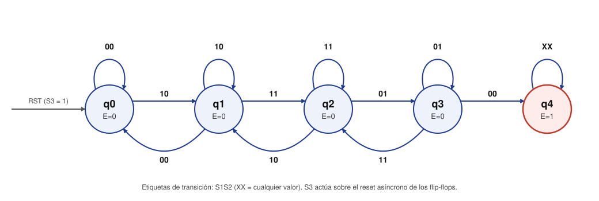

# Diseño de la máquina de estados — Control de balizas

## Entradas y salidas

| Señal | Tipo | Descripción |
|---|---|---|
| S1, S2 | Entrada | Sensores al comienzo del camino (1 = vehículo presente). |
| S3 | Entrada | Sensor al final del camino. Se conecta al reset asíncrono de los flip-flops. |
| CLK | Entrada | Reloj del sistema. |
| E (ENABLE) | Salida | 1 = balizas parpadeando, 0 = balizas apagadas. |

## Diagrama de estado/salida

Máquina de Moore: la salida E depende solo del estado actual. La flecha de
reset no se dibuja como transición sincrónica porque S3 actúa directamente
sobre el RST asíncrono de los flip-flops y lleva la máquina a q0 en cualquier
estado.

Las etiquetas de las transiciones son los valores de S1S2.

### Significado de cada estado

| Estado | Significado | E |
|---|---|---|
| q0 | Reposo: no hay vehículo en los sensores de ingreso (S1S2 = 00). | 0 |
| q1 | El vehículo activó S1 (S1S2 = 10). | 0 |
| q2 | El vehículo está sobre ambos sensores (S1S2 = 11). | 0 |
| q3 | El vehículo ya liberó S1 y solo activa S2 (S1S2 = 01). | 0 |
| q4 | Secuencia completa: el vehículo ingresó al camino. Permanece aquí hasta que S3 resetea el circuito. | 1 |

### Criterios de diseño

- **Permanencia:** si la entrada no cambia, el estado se mantiene. El reloj
  muestrea los sensores muchas veces mientras el vehículo pasa.
- **Retrocesos (Hip #2):** desde q1, q2 y q3 el vehículo puede volver al paso
  anterior de la secuencia. Un retroceso de varios pasos es la concatenación
  de retrocesos de un paso, porque los sensores cambian de a uno.
- **Combinaciones imposibles:** las entradas que no pueden aparecer en un
  estado (por ejemplo, S1S2 = 11 en q0) se tratan como indiferentes (X) para
  simplificar la lógica.
- **q4 ignora S1 y S2:** por Hip #1 y Hip #2 (barrera baja) no puede haber
  actividad en los sensores de ingreso mientras el vehículo está en el camino.
  Igualmente se fija q4 → q4 para cualquier entrada, de modo que una lectura
  espuria no apague las balizas.

## Tabla de estado/salida

| Estado actual | S1S2 = 00 | S1S2 = 01 | S1S2 = 11 | S1S2 = 10 | E |
|---|---|---|---|---|---|
| q0 | q0 | X | X | q1 | 0 |
| q1 | q0 | X | q2 | q1 | 0 |
| q2 | X | q3 | q2 | q1 | 0 |
| q3 | q4 | q3 | q2 | X | 0 |
| q4 | q4 | q4 | q4 | q4 | 1 |

## Asignación de codificación de los estados

Con 5 estados se necesitan k = ⌈log₂ 5⌉ = 3 bits, es decir, 3 flip-flops D
(Q2 Q1 Q0). Los códigos 101, 110 y 111 no se usan.

| Estado | Q2 | Q1 | Q0 |
|---|---|---|---|
| q0 | 0 | 0 | 0 |
| q1 | 0 | 0 | 1 |
| q2 | 0 | 1 | 1 |
| q3 | 0 | 1 | 0 |
| q4 | 1 | 0 | 0 |

**Justificación:**

- q0 = 000 porque es el estado al que lleva el reset asíncrono (todos los
  flip-flops en 0).
- q0 → q1 → q2 → q3 sigue código Gray: cada avance o retroceso cambia un solo
  bit, igual que los sensores. En estos estados Q1Q0 coincide con S2S1.
- q4 = 100 hace que la salida dependa de un único bit (E = Q2).
- Se compararon las 840 asignaciones posibles con q0 = 000 y esta es una de
  las de menor costo (menos compuertas y literales).

## Tabla de estado/salida con codificación asignada

| Q2 Q1 Q0 | S1S2 = 00 | S1S2 = 01 | S1S2 = 11 | S1S2 = 10 | E |
|---|---|---|---|---|---|
| 000 | 000 | XXX | XXX | 001 | 0 |
| 001 | 000 | XXX | 011 | 001 | 0 |
| 011 | XXX | 010 | 011 | 001 | 0 |
| 010 | 100 | 010 | 011 | XXX | 0 |
| 100 | 100 | 100 | 100 | 100 | 1 |
| 101 | XXX | XXX | XXX | XXX | X |
| 110 | XXX | XXX | XXX | XXX | X |
| 111 | XXX | XXX | XXX | XXX | X |

Con flip-flops D se cumple Q[n+1] = D[n], así que las columnas de estado
siguiente son directamente las entradas D2 D1 D0.

## Cálculo de la lógica de estado siguiente

Una tabla y un mapa de Karnaugh por cada entrada D. Como hay 5 variables
(Q2, Q1, Q0, S1, S2), cada mapa se divide en dos mapas de 4 variables: uno para
Q2 = 0 y otro para Q2 = 1. Filas Q1Q0 y columnas S1S2, ambas en orden Gray.

### D2

Q2 = 0:

| Q1Q0 \ S1S2 | 00 | 01 | 11 | 10 |
|---|---|---|---|---|
| 00 | 0 | X | X | 0 |
| 01 | 0 | X | 0 | 0 |
| 11 | X | 0 | 0 | 0 |
| 10 | **1** | 0 | 0 | X |

Q2 = 1:

| Q1Q0 \ S1S2 | 00 | 01 | 11 | 10 |
|---|---|---|---|---|
| 00 | **1** | **1** | **1** | **1** |
| 01 | X | X | X | X |
| 11 | X | X | X | X |
| 10 | X | X | X | X |

Agrupaciones: todo el mapa Q2 = 1 (término Q2), y en Q2 = 0 la fila Q1Q0 = 10
con las columnas S2 = 0 (00 y 10, la segunda indiferente).

**D2 = Q2 + Q1·Q0'·S2'**

### D1

Q2 = 0:

| Q1Q0 \ S1S2 | 00 | 01 | 11 | 10 |
|---|---|---|---|---|
| 00 | 0 | X | X | 0 |
| 01 | 0 | X | **1** | 0 |
| 11 | X | **1** | **1** | 0 |
| 10 | 0 | **1** | **1** | X |

Q2 = 1:

| Q1Q0 \ S1S2 | 00 | 01 | 11 | 10 |
|---|---|---|---|---|
| 00 | 0 | 0 | 0 | 0 |
| 01 | X | X | X | X |
| 11 | X | X | X | X |
| 10 | X | X | X | X |

Agrupación: en Q2 = 0, las dos columnas centrales completas (S2 = 1).

**D1 = Q2'·S2**

### D0

Q2 = 0:

| Q1Q0 \ S1S2 | 00 | 01 | 11 | 10 |
|---|---|---|---|---|
| 00 | 0 | X | X | **1** |
| 01 | 0 | X | **1** | **1** |
| 11 | X | 0 | **1** | **1** |
| 10 | 0 | 0 | **1** | X |

Q2 = 1:

| Q1Q0 \ S1S2 | 00 | 01 | 11 | 10 |
|---|---|---|---|---|
| 00 | 0 | 0 | 0 | 0 |
| 01 | X | X | X | X |
| 11 | X | X | X | X |
| 10 | X | X | X | X |

Agrupación: en Q2 = 0, las dos columnas de la derecha completas (S1 = 1).

**D0 = Q2'·S1**

## Cálculo de la lógica de salida

Máquina de Moore: E depende solo de Q2 Q1 Q0.

| Q2 \ Q1Q0 | 00 | 01 | 11 | 10 |
|---|---|---|---|---|
| 0 | 0 | 0 | 0 | 0 |
| 1 | **1** | X | X | X |

**E = Q2**

## Resumen de ecuaciones

| Señal | Ecuación |
|---|---|
| D2 | Q2 + Q1·Q0'·S2' |
| D1 | Q2'·S2 |
| D0 | Q2'·S1 |
| E | Q2 |

Compuertas necesarias: 3 flip-flops D con reset asíncrono, 1 compuerta AND de
3 entradas, 2 AND de 2 entradas, 1 OR de 2 entradas y los inversores para Q2',
Q0' y S2' (Q2' y Q0' también pueden tomarse de la salida Q' de cada
flip-flop).

## Verificación

Las ecuaciones se verificaron simulando todas las transiciones definidas en la
tabla de estado/salida: todas producen el estado siguiente esperado.

Comportamiento en los casos indiferentes (no deberían ocurrir):

- Los estados no usados 101, 110 y 111 pasan a q4 en el siguiente flanco de
  reloj. El reset por S3 lleva cualquier estado a q0.
- En q3, una entrada S1S2 = 10 lleva al código 101 y luego a q4.
