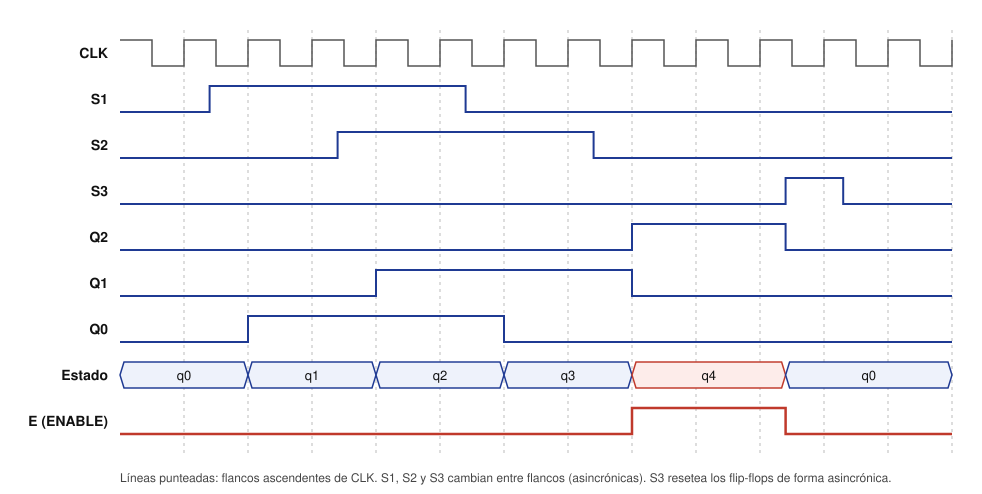

# Diagrama de tiempos — Ingreso y egreso típico

Caso típico: un vehículo ingresa al camino sin retroceder al pasar por S1 y S2,
y luego sale activando S3.

## Lectura del diagrama

| Momento | Evento | Estado | E |
|---|---|---|---|
| Inicio | No hay vehículo (S1S2 = 00). | q0 | 0 |
| Entre flancos 1 y 2 | El vehículo activa S1 (S1S2 = 10). En el flanco 2 la máquina lo registra. | q1 | 0 |
| Entre flancos 3 y 4 | El vehículo activa S2 (S1S2 = 11). | q2 | 0 |
| Entre flancos 5 y 6 | El vehículo libera S1 (S1S2 = 01). | q3 | 0 |
| Entre flancos 7 y 8 | El vehículo libera S2 (S1S2 = 00): la secuencia está completa. En el flanco 8 se habilita la salida. | q4 | 1 |
| Entre flancos 10 y 11 | El vehículo llega al final y activa S3. El reset asíncrono lleva la máquina a q0 en ese instante, sin esperar el reloj. | q0 | 0 |

## Observaciones

- **Entradas asíncronas:** S1, S2 y S3 cambian entre flancos de reloj, porque
  dependen del vehículo y no del reloj del sistema.
- **Retardo de actuación:** cada cambio de los sensores se refleja en el estado
  recién en el siguiente flanco ascendente de CLK. Por eso E sube en el flanco 8
  y no en el instante en que se libera S2.
- **Reset inmediato:** a diferencia de las transiciones normales, el reset por
  S3 actúa sin esperar el flanco, por eso E cae junto con la subida de S3.
- **Codificación visible:** mientras se detecta la secuencia, Q1Q0 copia a
  S2S1 con un ciclo de retardo. En q4 solo Q2 está en 1, y E = Q2.
- **Generación:** la figura se genera con `figuras/generar_diagrama_tiempos.py`,
  que simula las ecuaciones del diseño. Si el diseño cambia, se vuelve a
  ejecutar el script.
